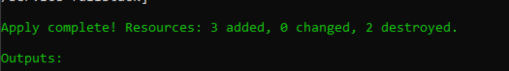
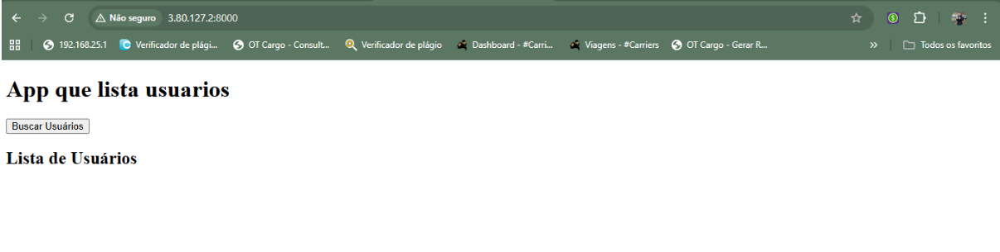
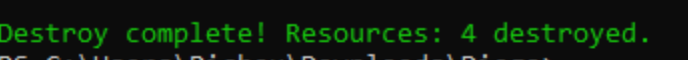

# RELÁTORIO DE EXECUÇÃO

**Imagem 01**

Imagem do terraform apply após a execução

**Imagem 02**

Imagem do container rodando uma aplicação phyton simples na web pelo ip público oferecido pelo AWS

**Imagem 03**

Imagem do terraform destroy após a execução

